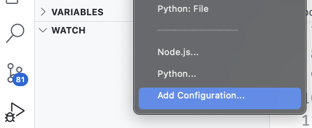
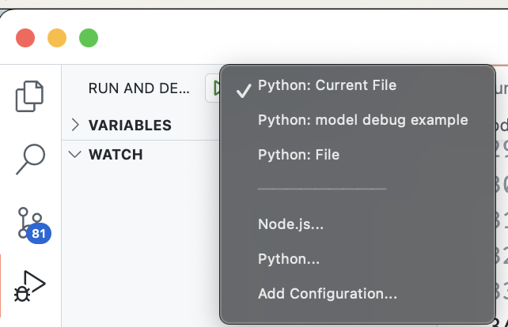
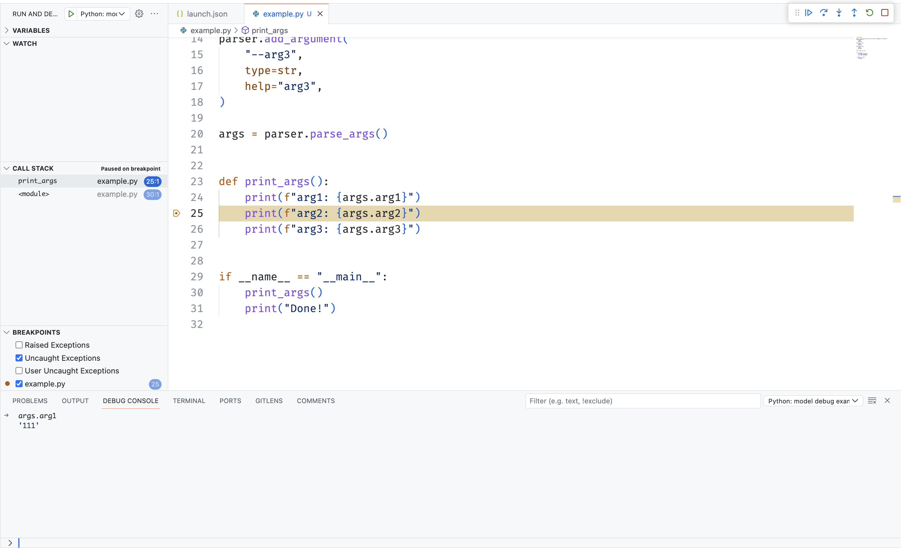

畢業了，論文也交到學校圖書館，我在學術研究的學徒生涯可說是告一段落。因此想在這個時間點，整理一下在碩士生期間，一些對我跑實驗、改 code 方便又實用的小技巧。希望這些技巧能幫助到其他在這個領域的學徒們，讓大家在邁向畢業的目標時走得更順利！

## 1. 你需要一個「開發用」資料集
這裡提的開發用資料集，不是在訓練模型時會切分 train/dev/test set 的那個 dev set，而是真的你會利用這個「開發用的資料集」來進行程式碼上的 development。通常在這些領域，無論你是電腦視覺、自然語言處理，或是其他深度學習與 AI 的模型方法，你總是有機會遇到需要訓練在一個稍微大的資料集，因此模型訓練時間會很久，從數十分鐘到數小時不等。這時，假如需要再對程式碼進行開發，比如說你自己要設計的模型，可能是基於某篇論文 github 的程式，但你需要更改其中某些部分，來實作自己的方法；或是原始論文並不會在 epoch 迭代中算出你想看到的數值，所以你需要加一小段程式碼進去。這些狀況下，我們都會在 debug mode 中做調整，但假如模型每訓練一次就要一個小時，偏偏你做的更動需要在模型訓練好之後，才能確認效果，這時候就會花很多時間在等待上。

根據我慘痛的教訓，這時候你如果有一個資料筆數極小的開發用資料集，會對開發的效率上非常有幫助。例如可能 500 筆、1000 筆，或是極端一點 10 筆，總之就是一個讓你跑完你的模型，在體感上不會花太久時間的資料量，你就能夠快速針對自己要開發的特定部分，進行有效率的「寫 code -> 看結果 -> debug」循環。利用這個小巧的開發用資料集，你可以把程式碼寫好，確定「他會 work！他不會噴 error！」，運行起來不會有程式上面的問題後，就會比較能夠集中火力花時間思考偏「模型效果」的部分，例如這模型的 accuracy 怎麼會那麼低。

當初我在改某個模型的時候，就是因為同時在處理「程式上的正確性」與「模型效果」這兩件事情，導致有些問題明明是我程式在撰寫上面的 bug，但是我都得花一小時才能看到結果。當初大腦不知為什麼就頓頓的，沒有想到這個小訣竅。假如我可以先用「開發用資料集」把程式碼的正確性處理好的話，我就可以把時間花在思考模型效果上面，而不是等模型跑 1 小時訓練完之後，發現「欸我這邊變數打錯了」這種比較浪費時間的結果。

## 2. 寫好 vscode 的 `launch.json` 來 debug 模型會很方便
[vscode 他們自己的介紹其實就寫得滿清楚的](https://code.visualstudio.com/docs/python/debugging)，我這邊就簡單舉一個例子。通常簡單的 python debug 我們只會對參數都寫在 python script 裡面的程式碼進行 debug，就是直接按下由上角的那個 debug 按鈕。不過這個領域的論文 source code，他們都會用一個 `main.py` 來執行模型，然後利用 python 的 `argparse` 這個模組，來從 command line 傳入要傳進模型的參數。下面是一個簡單的例子：
```python
python main.py --arg1 1 --arg2 2 --arg3 3
```
例如這個 [facebook research 出的 `MUSE` 模型](https://github.com/facebookresearch/MUSE)，就是走這種模式。那我們要怎麼樣對這種需要在 command line 傳入參數的程式進行 debug？這時候我們就會需要寫好 vscode 的 `launch.json`。這邊簡單列一個我的例子：
```json
{
    // Use IntelliSense to learn about possible attributes.
    // Hover to view descriptions of existing attributes.
    // For more information, visit: https://go.microsoft.com/fwlink/?linkid=830387
    "version": "0.2.0",
    "configurations": [
        {
            "name": "Python: model debug example",
            "type": "python",
            "request": "launch",
            "program": "example.py",
            "console": "integratedTerminal",
            "justMyCode": true,
            "args": [
                "--arg1",
                "111",
                "--arg2",
                "222",
                "--arg3",
                "333",
            ]
        },
    ]
}
```
我們可以從左邊側邊欄的 debug 按鈕按這個 `add configuration` 來設定自己的程式 launch 的方法要怎麼 launch，詳情可以上去 vscode 的文件看。  
  
  

設定好之後，我們可以在 run and debug 的選項裡面看到我們剛剛自己貼的 `Python: model debug example`。如此一來，我們就可以從這邊用帶有參數 `--arg1` ~ `--args3` 的方式來 debug 我們的程式碼了。按下去之後，我們可以看到 vscode 會幫我們在 terminal 執行像下面的東西：
```bash
(cluster_topic_model) ➜ llm-clusterTM (main) ✗  cd /Users/evan19983314/project/llm-clusterTM ; /usr/bin/env /opt/homebrew/Caskroom/miniforge/base/envs/cluster_topic_model/bin/python /Users/evan19983314/.vscode/extensions/ms-python.python-2023.18.0/pythonFiles/lib/python/debugpy/adapter/../../debugpy/launcher 51328 -- example.py --arg1 111 --arg2 222 --arg3 333 
```
我們可以看到，在執行的時候，他會幫我們帶入這三個參數傳入 `example.py` 這個 script。同時我們也就可以在 `example.py` 程式中設置斷點，然後再 console 中看到我們的變數，進行 debug，像是下面的畫面：  
  

透過這種寫好 launch.json 的方式，我們就可以在 vscode 中，對這種需要在 command line 傳入參數的程式進行 debug，進而對論文的 source code 進行修改，或是做更仔細的 trace code，方便了解他的 code 是如何實作他在論文中設計出來的方法。

以上這兩個小技巧，就是在研究生期間，方便我自己快速做模型的程式碼開發跟改動的方法。希望這兩個小技巧能夠對其他同在這個領域的學徒們有所幫助，並且早日畢業！